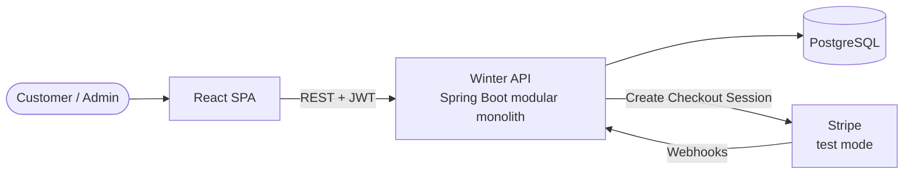
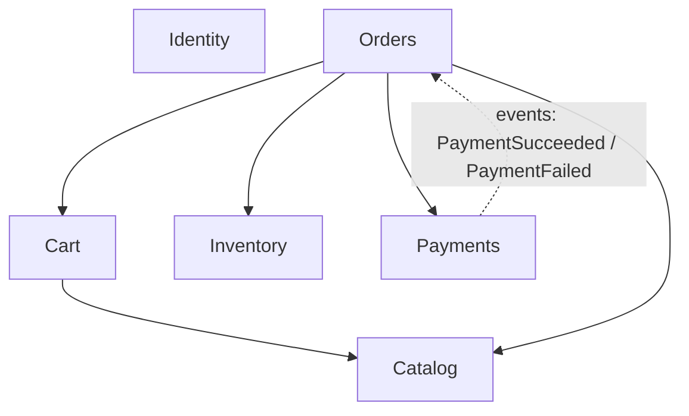
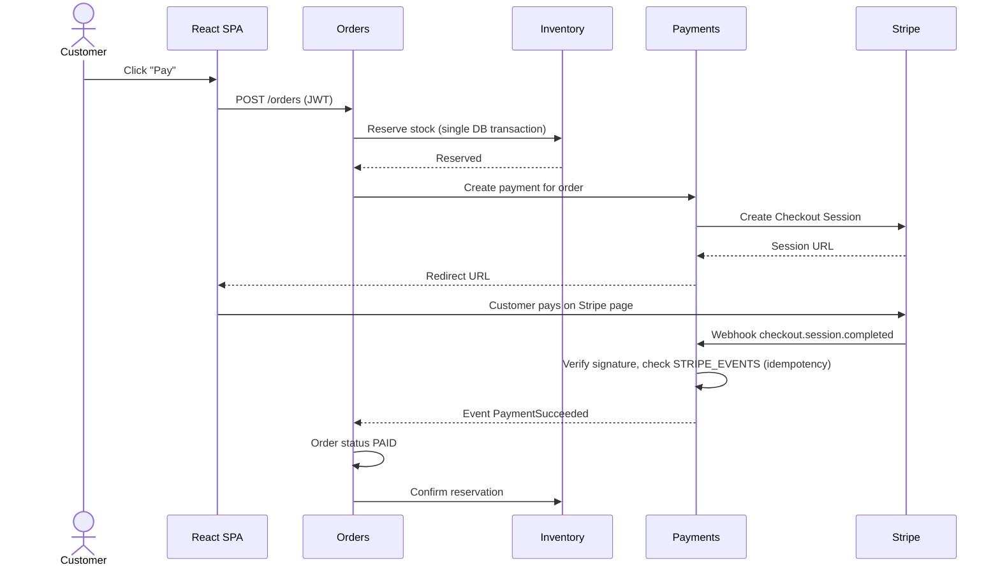

# Architecture (v1)

Winter is a modular monolith (see [ADR 001](adr-001-modular-monolith.md)). The diagrams render automatically on GitHub.

## 1. System context



## 2. Modules and dependencies



Rules:

- Dependencies point in one direction only. `Payments` never calls `Orders` directly; it publishes events that `Orders` listens to. This avoids a circular dependency.
- A module only uses another module's public interface, never its internal classes or tables.
- `Identity` provides authentication to the whole application (security filter) and is not called by business modules.

## 3. Internal structure of each module

```
com.winter.<module>/
├── api/             REST controllers and request/response objects
├── application/     use cases (business operations)
├── domain/          entities and business rules
└── infrastructure/ database access and external services
```

Business rules live in `domain`. Controllers stay thin and the database and Stripe details stay in `infrastructure`.

## 4. Checkout flow (the core problem)



Failure path: if the payment fails, the Checkout Session expires or the order is canceled, the reservation is released and the stock becomes available again.

Key guarantees:

- **No overselling:** reservation uses optimistic locking on `INVENTORY.version`.
- **No duplicate processing:** each Stripe event id is stored once; repeated webhooks are ignored.
- **No trust in the browser:** an order is marked `PAID` only after the webhook, never because the customer was redirected back to the site.
- **Consistency:** creating the order and reserving stock happen in one database transaction.

## 5. Cross-cutting concerns

| Concern | Approach |
|---|---|
| Authentication | JWT issued by `Identity`, validated by a security filter |
| Authorization | Roles `CUSTOMER` and `ADMIN`, checked per endpoint |
| Errors | Standard error response format across the API |
| Database changes | Versioned migrations with Flyway |
| Tests | Unit tests for domain rules, integration tests with a real PostgreSQL (Testcontainers) |
| Delivery | Docker for local run, GitHub Actions for CI |