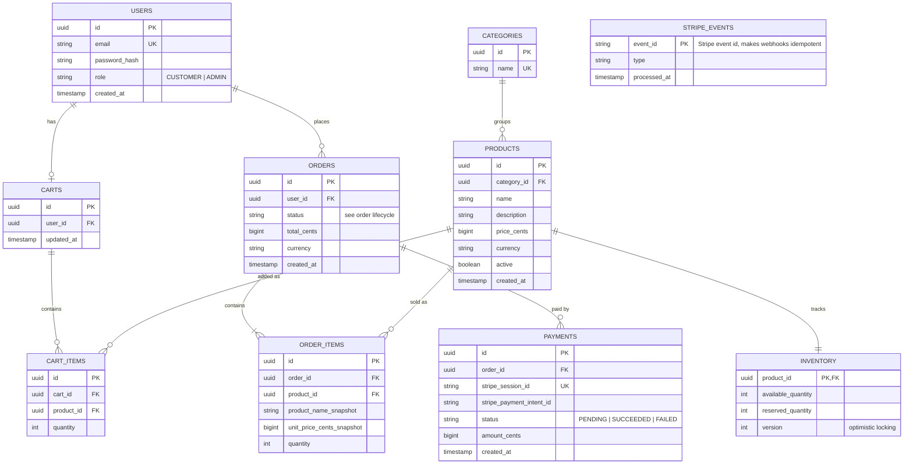

# Data model (v1)

Relational model for PostgreSQL. The diagram renders automatically on GitHub.



## Order lifecycle

```
CREATED -> PAID -> SHIPPED -> DELIVERED
   |
   +--> CANCELED   (allowed from CREATED or PAID)
```

Only these transitions are valid. Any other transition is rejected by the domain rules.

## Design decisions

1. **Money as integer cents** (`price_cents`), never floating point. Avoids rounding errors.
2. **Price and name snapshot in `ORDER_ITEMS`.** Changing a product later must not change past orders.
3. **Separate `INVENTORY` table with `available` and `reserved`.** Stock is reserved when the order is created and confirmed or released depending on the payment result. The `version` column supports optimistic locking, which prevents overselling under concurrent purchases.
4. **`STRIPE_EVENTS` table.** Each webhook event is stored by its Stripe id. If the same event arrives twice, the second one is ignored (idempotency).
5. **UUIDs as primary keys.** Ids are not guessable or sequential, which is safer to expose in a public API.
6. **`PAYMENTS` separate from `ORDERS`.** An order can have more than one payment attempt (for example, a failed card followed by a successful one).
7. **Passwords stored only as hashes** (`password_hash`), never in plain text.